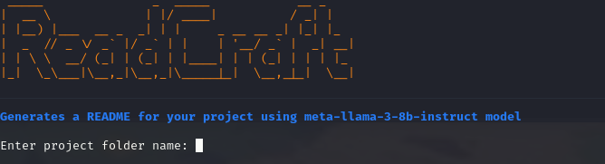
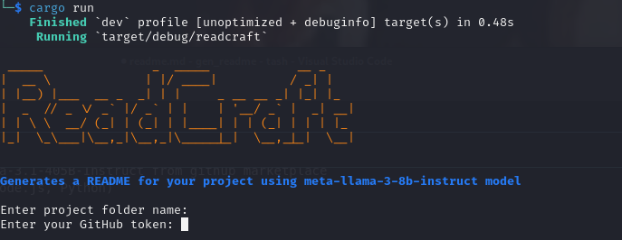
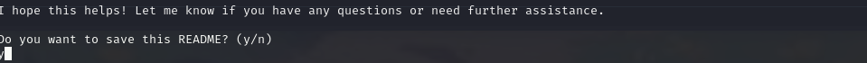

# README Generator

## Project Description
This project is a README generator that automatically creates comprehensive README.md files for software projects. 

## Features
- Gathers project information automatically
- Generates README content using OpenAI GPT-4o mini from github marketplace
- Supports multiple project types (Rust, Node.js, Python)
- Retries on API failures

## CLI Interface 


## Installation
To install this project, follow these steps:

1. Clone the repository:
   ```
   git clone [your-repo-url]
   cd [your-project-name]
   ```

2. Ensure you have Rust installed on your system. 
   If not, install it from [https://www.rust-lang.org/tools/install](https://www.rust-lang.org/tools/install)

3. Build the project:
   ```
   cargo build --release
   ```
4. Run the program:
    ```
    cargo run
    ``` 
## Usage
Ensure you have github access token in order to access their API. Create an environment variable to set your token as the key for the client code by:
   ```
   export GITHUB_TOKEN="<your-github-token-goes-here>"
   ```
If you do not do this it will prompt you for the key


The readme generator will prompt you to:
    1. Enter the path to your project directory. 


## Configuration
It checks at all available files and gets the necessary content needed for generating the content of readme


## Contributing
Contributions to this project are welcome. Please follow these steps:

1. Fork the repository
2. Create a new branch (`git checkout -b feature/your-feature`).
3. Make your changes.
4. Commit your changes (`git commit -am 'Add some feature'`).
5. Push to the branch (`git push origin feature/your-feature`).
6. Create a new Pull Request.

## Contact
[email: kinyuanatasha657@gmail.com]